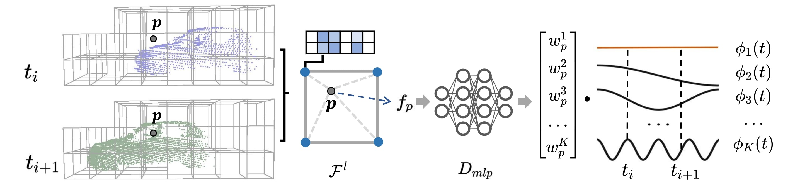

<p align="center">
  <h1 align="center">3D LiDAR Mapping in Dynamic Environments using a 4D Implicit Neural Representation</h1>

  <p align="center">
    <a href="https://github.com/PRBonn/4dNDF"></a>
    <a href="https://github.com/PRBonn/4dNDF"></a>
    <a href="https://www.ipb.uni-bonn.de/wp-content/papercite-data/pdf/zhong2024cvpr.pdf">.svg?style=flat-square" /></a>
    <a href="https://lbesson.mit-license.org/"></a>
  </p>


  <p align="center">
    <a href="https://www.ipb.uni-bonn.de/people/xingguang-zhong/index.html"><strong>Xingguang Zhong</strong></a>
    ·
    <a href="https://www.ipb.uni-bonn.de/people/yue-pan/index.html"><strong>Yue Pan</strong></a>
    ·
    <a href="https://www.ipb.uni-bonn.de/people/cyrill-stachniss/"><strong>Cyrill Stachniss</strong></a>
    .
    <a href="https://www.ipb.uni-bonn.de/people/jens-behley/"><strong>Jens Behley</strong></a>
  </p>
  <p align="center"><a href="https://www.ipb.uni-bonn.de"><strong>University of Bonn</strong></a>
  <h3 align="center"><a href="https://arxiv.org/pdf/2401.09101v1.pdf">Paper</a> | Video</a></h3>
  <div align="center"></div>
</p>



| Demo |
| :-: |
 |

<!-- TABLE OF CONTENTS -->

<details open="open" style='padding: 10px; border-radius:5px 30px 30px 5px; border-style: solid; border-width: 1px;'>
  <summary>Table of Contents</summary>
  <ol>
    <li>
      <a href="#abstract">Abstract</a>
    </li>
    <li>
      <a href="#installation">Installation</a>
    </li>
    <li>
      <a href="#run-pin-slam">How to run </a>
    </li>
    <li>
      <a href="#contact">Contact</a>
    </li>
    <li>
      <a href="#citation">Citation</a>
    </li>
  </ol>
</details>


## Abstract

<details>
  <summary>[Details (click to expand)]</summary>
Building accurate maps is a key building block to enable reliable localization, planning, and navigation of au-tonomous vehicles. We propose a novel approach for building accurate maps of dynamic environments utilizing a sequence of LiDAR scans. To this end, we propose encoding the 4D scene into a novel spatio-temporal implicit neural map representation by fitting a time-dependent truncated signed distance function to each point. Using our representation, we extract the static map by filtering the dynamic parts. Our neural representation is based on sparse feature grids, a globally shared decoder, and time-dependent basis functions, which we jointly optimize in an unsupervised fashion. To learn this representation from a sequence of LiDAR scans, we design a simple yet efficient loss function to supervise the map optimization in a piecewise way. We evaluate our approach on various scenes containing moving objects in terms of the reconstruction quality of static maps and the segmentation of dynamic point clouds. The experimental results demonstrate that our method is capable of removing the dynamic part of the input point clouds while reconstructing accurate and complete 3D maps, outperforming several state-of-the-art methods.
</details>

## Installation

### 1. Set up conda environment

```
conda create --name 4dndf python=3.8
conda activate 4dndf
```

### 2. Install PyTorch

```
conda install pytorch==1.13.0 torchvision==0.14.0 torchaudio==0.13.0 pytorch-cuda=11.6 -c pytorch -c nvidia
```

The commands depend on your CUDA version. You may check the instructions [here](https://pytorch.org/get-started/previous-versions/).

### 3. Install PyTorch3D

Follow the official instructions [here](https://github.com/facebookresearch/pytorch3d/blob/main/INSTALL.md)


### 4. Install other dependency

```
pip install open3d==0.17 scikit-image tqdm pyquaternion pypose
```

